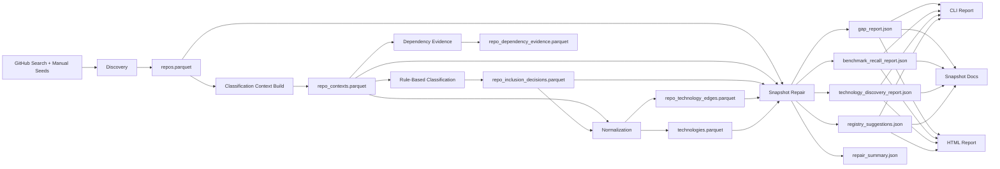
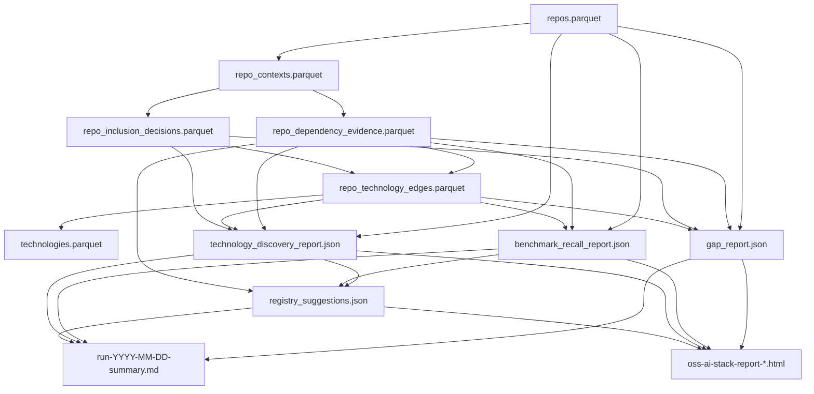
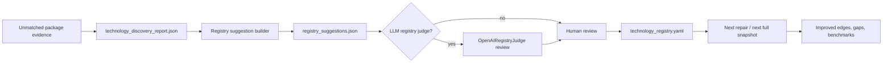

# Architecture

This document describes the current architecture of `oss-ai-stack-map`: how repositories are discovered, how technology evidence is extracted and normalized, how repaired snapshots are produced, and how the canonical technology registry is now fed by both curated config and data-driven suggestions.

## Goals

The system is built to answer one question well:

How do serious open source AI projects actually compose their technology stacks?

That breaks down into five architectural requirements:

1. Discover a broad but still relevant universe of OSS repos.
2. Classify which repos belong in the published AI stack map.
3. Extract technology evidence from manifests, SBOMs, imports, and selected metadata.
4. Normalize raw evidence into a stable canonical technology graph.
5. Continuously improve the registry using gap analysis, benchmarks, graph-based candidate discovery, and optional LLM review.

## Top-Level Flow

## Main Components

### 1. Config Layer

Primary files:

- `config/study_config.yaml`
- `config/discovery_topics.yaml`
- `config/technology_aliases.yaml`
- `config/technology_registry.yaml`
- `config/benchmark_entities.yaml`
- `config/segment_rules.yaml`

Loader:

- `src/oss_ai_stack_map/config/loader.py`

Purpose:

- Holds thresholds and snapshot date.
- Defines discovery topics and manual repo seeds.
- Separates legacy alias-based normalization from the canonical registry.
- Defines benchmark entities used to measure recall.
- Defines segment scoring rules used during repo classification.

Important design decision:

`technology_aliases.yaml` is still the legacy exact-match normalization layer. `technology_registry.yaml` is now the primary curated research surface for technology families, canonical repos, package prefixes, entity types, and capabilities.

### 2. Discovery

Primary files:

- `src/oss_ai_stack_map/pipeline/discovery.py`
- `src/oss_ai_stack_map/github/client.py`

Purpose:

- Query GitHub using topics, description keywords, and manual seed repos.
- Normalize raw GraphQL repository metadata into `DiscoveredRepo` rows.

Output:

- `repos.parquet`

Important detail:

Discovery is intentionally broad. Precision is enforced later by classification, normalization, benchmark recall, and gap analysis.

### 3. Classification

Primary file:

- `src/oss_ai_stack_map/pipeline/classification.py`

Purpose:

- Build repo context from README, tree paths, manifests, SBOMs, and imports.
- Score seriousness and AI relevance.
- Optionally apply the OpenAI repo judge for hardening or validation.

Key outputs:

- `repo_contexts.parquet`
- `repo_dependency_evidence.parquet`
- `repo_inclusion_decisions.parquet`
- `judge_decisions.parquet`

Evidence sources extracted here:

- Manifest dependencies
- SBOM dependencies
- Import-derived dependencies

Evidence is matched in layers:

1. exact alias match
2. registry alias match
3. registry package-prefix match
4. provider inference for family/package matches

### 4. Normalization

Primary file:

- `src/oss_ai_stack_map/pipeline/normalize.py`

Purpose:

- Convert raw dependency evidence into canonical repo-technology edges.
- Emit canonical technology rows from aliases plus registry.
- Add repo-identity edges for canonical upstream repos.
- Add derived provider subedges where appropriate.
- Add low-confidence README mention edges for final repos that otherwise have no normalized technology edge.

Important edge types now supported:

- `manifest`
- `sbom`
- `import`
- `repo_identity`
- `readme_mention`

This is the key shift from earlier snapshots: normalization is no longer limited to exact alias luck. It now captures family/package patterns such as Vercel AI SDK, Browserbase, MCP, OpenAI Agents, PyTorch, Hugging Face Hub, Tokenizers, and similar ecosystems.

README mention edges are an explicit low-confidence fallback layer. They are only added when an included repo would otherwise remain unmapped, and they should be reviewed separately from direct dependency evidence before carrying strong graph-interpretation weight.

## Snapshot Repair

Primary file:

- `src/oss_ai_stack_map/analysis/snapshot.py`

Purpose:

- Rebuild a consistent repaired snapshot from an existing run using current config and code.
- Rebind old dependency evidence against the current registry.
- Re-run normalization and reporting artifacts without doing a full fresh GitHub crawl.

Why repair exists:

Research evolves faster than repo discovery. Repair lets us improve normalization, benchmarks, and reporting on top of the same discovered universe.

## Artifact Lineage

## Research Feedback Loops

### Gap Analysis

Primary file:

- `src/oss_ai_stack_map/pipeline/reporting.py`

The gap report now distinguishes:

- final repos missing edges with unmapped dependency evidence
- final repos missing edges with no dependency evidence
- top unmatched packages
- top unmatched package prefixes
- vendor-like unmapped repos

This is important because "missing edge" is not one problem:

- some repos clearly use stack components we still do not normalize
- some repos are in the final set due metadata/judge/config evidence but do not expose stack deps in manifests

### Benchmark Recall

Also in:

- `src/oss_ai_stack_map/pipeline/reporting.py`

Benchmarks track whether important AI stack entities are:

- discovered
- included in the final set
- mapped via repo identity
- adopted by third-party repos
- visible in dependency evidence

Important detail:

Third-party adoption gaps are now only prioritized when there is actual third-party dependency evidence, not when evidence exists only inside the entity's own repo.

### Technology Discovery

Primary file:

- `src/oss_ai_stack_map/pipeline/technology_discovery.py`

This is the automatic discovery layer.

It builds a projected graph of unmatched technology families from package evidence and ranks them using:

- repo count
- final repo count
- missing-edge repo count
- star-weighted reach
- weighted degree
- degree centrality
- betweenness centrality
- eigenvector centrality
- benchmark overlap

This stage is intentionally not the canonical registry. It is the candidate-generation engine.

### Registry Suggestions

Primary file:

- `src/oss_ai_stack_map/pipeline/registry_suggestions.py`

This stage is the bridge between discovery and curation.

It:

- filters out already-covered families
- proposes canonical ids, display names, categories, aliases, package prefixes, and repo names
- emits `registry_suggestions.json`
- can optionally attach an LLM review for each candidate

## Canonical Registry Curation Flow

## LLM Judges

### Repo Judge

Primary file:

- `src/oss_ai_stack_map/openai/judge.py`

Purpose:

- Conservative inclusion review for repo classification.

### Registry Judge

Primary file:

- `src/oss_ai_stack_map/openai/registry_judge.py`

Purpose:

- Conservative curation review for candidate canonical technologies.

Current usage model:

- optional
- cached
- conservative by design
- intended to narrow the review queue, not replace curation entirely

## Commands

Primary CLI:

- `src/oss_ai_stack_map/cli.py`

Main commands:

- `discover`
- `classify`
- `snapshot-repair`
- `report`
- `snapshot-docs`
- `snapshot-validate`
- `registry-suggestions`

The important operational split is:

- use `discover` and `classify` for a fresh run
- use `snapshot-repair` to iterate on normalization and research quality

## What Is Still Deliberately Curated

The system is not fully auto-canonical.

These remain curated on purpose:

- canonical technology ids
- canonical repo identities
- benchmark entities
- category assignment for promoted families

The architecture now uses auto discovery to find and rank candidates, but promotion into the registry still requires either human review or optional LLM-assisted review.

## Current Research Posture

The architecture has moved from:

- repo discovery plus hand-entered exact aliases

to:

- repo discovery
- structured evidence extraction
- family-level normalization
- repaired snapshot iteration
- benchmark-driven recall
- graph-driven candidate discovery
- registry suggestion generation
- optional LLM-assisted registry review

That is the intended operating model going forward.
