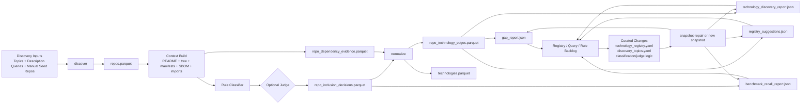

# AUTORESEARCH PLAN

## Goal

Build a high-precision, high-coverage map of the technologies most used by serious open source AI projects.

The target output is not just a repo list. It is a stable, explainable map of:

- which repos belong in the OSS AI universe
- which canonical technologies those repos actually use
- which providers, products, SDK families, and package families dominate the stack
- where the pipeline is still blind or uncertain

## System Diagram

## Current Model

The current repo works like this:

- Discovery builds a candidate universe from GitHub topics, description keywords, and manual seed repos in [`config/discovery_topics.yaml`](/home/agent/oss-ai-stack-map/config/discovery_topics.yaml).
- Classification builds repo context and applies rule-based serious-project and AI-relevance scoring in [`classification.py`](/home/agent/oss-ai-stack-map/src/oss_ai_stack_map/pipeline/classification.py).
- The optional judge reviews selected repo decisions. It is a repo-inclusion aid, not a discovery engine and not a technology-expansion engine.
- Normalization maps dependency evidence into canonical technologies using aliases plus the registry in [`config/technology_registry.yaml`](/home/agent/oss-ai-stack-map/config/technology_registry.yaml).
- Reporting emits gap reports, benchmark recall, technology discovery candidates, and registry suggestions.
- Snapshot repair lets the project re-run normalization and reporting against an existing snapshot without a new GitHub crawl.

## North-Star Metrics

Every improvement should be evaluated against a stable scorecard.

- `repo_discovered_rate` from `benchmark_recall_report.json`
- `repo_included_rate` from `benchmark_recall_report.json`
- `repo_identity_mapped_rate` from `benchmark_recall_report.json`
- `third_party_adoption_rate` from `benchmark_recall_report.json`
- `dependency_evidence_rate` from `benchmark_recall_report.json`
- `final_repos_missing_edges_count` from `gap_report.json`
- `final_repos_missing_edges_with_unmapped_dependency_evidence_count` from `gap_report.json`
- Judge cost and usage volume from stage timings and `judge_decisions.parquet`
- Regression count from config validation and tests

## Operating Principle

Adopt an autoresearch-style loop, but constrain the mutable surface.

- Freeze the evaluation harness on a reference snapshot.
- Change one lever at a time.
- Measure whether the change improved benchmark recall, reduced missing edges, or improved precision.
- Keep only changes that improve the map or simplify the system without hurting the scorecard.

Preferred mutable surfaces:

- [`config/technology_registry.yaml`](/home/agent/oss-ai-stack-map/config/technology_registry.yaml)
- [`config/discovery_topics.yaml`](/home/agent/oss-ai-stack-map/config/discovery_topics.yaml)
- classification logic in [`classification.py`](/home/agent/oss-ai-stack-map/src/oss_ai_stack_map/pipeline/classification.py)
- judge selection and prompts in [`classification.py`](/home/agent/oss-ai-stack-map/src/oss_ai_stack_map/pipeline/classification.py), [`judge.py`](/home/agent/oss-ai-stack-map/src/oss_ai_stack_map/openai/judge.py), and [`registry_judge.py`](/home/agent/oss-ai-stack-map/src/oss_ai_stack_map/openai/registry_judge.py)

## Experiment Harness

Create a repeatable improvement loop:

1. Pick one lever.
2. Record the baseline metrics from the latest repaired snapshot.
3. Make a single bounded change.
4. Run `snapshot-repair` when possible. Run a fresh `snapshot` only when discovery inputs changed.
5. Compare the old and new outputs.
6. Keep the change only if it improves the scorecard or meaningfully simplifies the system.
7. Log the experiment in an append-only ledger.

Recommended ledger fields:

- date
- branch or commit
- lever
- files changed
- baseline snapshot
- evaluation command
- benchmark deltas
- missing-edge deltas
- decision: keep or discard
- note

## Improvement Levers

### 1. Discovery

Objective: improve candidate-universe recall without collapsing precision.

Tasks:

- [ ] Audit every benchmark entity against discovery outputs.
- [ ] Explain every `repo_discovered: false` benchmark gap with a concrete root cause.
- [ ] Fix the `Daytona` mismatch first because the manual seed already exists but the benchmark still reports it undiscovered.
- [ ] Add tests that assert manual seeds are surfaced in discovery outputs when reachable.
- [ ] Expand topic and description queries only when a benchmark or repeated gap justifies it.
- [ ] Track query contribution and noise by source so weak queries can be pruned.
- [ ] Add a discovery report that shows which queries found which benchmark entities.
- [ ] Consider adding repo-identity-driven expansion only after the current discovery baseline is stable.

Success criteria:

- benchmark repo discovery reaches or approaches 100%
- discovery changes do not materially inflate obvious non-AI or low-seriousness candidates

### 2. Rule Classifier

Objective: improve precision of the final repo set while preserving recall on credible AI projects.

Tasks:

- [ ] Separate false positives and false negatives from the current final set into an explicit review set.
- [ ] Add test fixtures for borderline cases: tooling, developer platforms, infra, research code, and adjacent non-AI repos.
- [ ] Make score contributions explainable at the decision level if they are not already obvious.
- [ ] Tighten rules that are overly sensitive to broad README or topic language.
- [ ] Improve rules that detect direct AI evidence from manifests, config, model/provider dependencies, and runtime structure.
- [ ] Add snapshot-level regression tests for benchmark entities and curated hard cases.
- [ ] Validate that segment assignment rules are aligned with the registry and do not reference missing IDs.

Success criteria:

- fewer benchmark inclusion misses
- fewer judged overrides needed for obviously correct cases
- no drift between segment rules and known technologies

### 3. Judge

Objective: use LLM review where it adds value, not as a substitute for deterministic logic.

Tasks:

- [ ] Document exact judge entry criteria: borderline exclude, borderline include, validation sample, registry review.
- [ ] Audit current judge prompts and outputs for avoidable ambiguity.
- [ ] Separate hardening and validation success metrics.
- [ ] Tighten candidate selection so cheap deterministic cases never hit the judge.
- [ ] Add prompt examples for ambiguous AI-adjacent repos.
- [ ] Log judge disagreement patterns and feed them back into deterministic rules first.
- [ ] Add a small benchmark set specifically for judge-worthy cases.
- [ ] Measure whether judge calls actually improve inclusion quality enough to justify cost and latency.

Success criteria:

- lower judge volume for the same or better final quality
- clearer and more reproducible overrides

### 4. Technology Registry and Normalization

Objective: maximize canonical mapping coverage for real stack technologies.

Tasks:

- [ ] Treat [`config/technology_registry.yaml`](/home/agent/oss-ai-stack-map/config/technology_registry.yaml) as the primary curated research asset.
- [ ] Review current `registry_suggestions.json` candidates and either promote, reject, or defer them with reasons.
- [ ] Prioritize candidates that reduce missing-edge final repos.
- [ ] Add missing repo identities, package prefixes, and import aliases for high-signal technologies.
- [ ] Distinguish provider, product, sdk_family, and package_family consistently.
- [ ] Add config validation that every `technology_id` referenced by segment rules exists in aliases or registry.
- [ ] Add config validation that registry entries have coherent aliases, prefixes, repo names, and category/entity metadata.
- [ ] Build tests around currently missing-edge repos so accepted registry changes stay fixed.

Success criteria:

- `final_repos_missing_edges_count` trends toward zero
- more final repos map via high-confidence evidence instead of README fallback

### 5. Gap Mining and Candidate Discovery

Objective: convert unmapped evidence into a ranked, reviewable backlog.

Tasks:

- [ ] Keep `gap_report.json`, `technology_discovery_report.json`, and `registry_suggestions.json` as first-class artifacts.
- [ ] Separate AI-specific unmatched families from commodity/tooling noise more aggressively.
- [ ] Rank candidate families by impact on final repos, benchmark overlap, and missing-edge reduction.
- [ ] Add deduping rules so the same concept does not appear under multiple family names.
- [ ] Surface exemplar repos and exemplar packages for every candidate family.
- [ ] Add a reviewer workflow that marks candidates accepted, rejected, or deferred.
- [ ] Emit the top unresolved candidate families in the report and explainer.

Success criteria:

- candidate backlog becomes actionable rather than noisy
- accepted candidates produce measurable coverage gains

### 6. Evaluation Harness

Objective: make keep/discard decisions objective and fast.

Tasks:

- [ ] Add a single comparison command that reads two snapshots and prints metric deltas.
- [ ] Add a compact experiment scorecard markdown or JSON output.
- [ ] Freeze a reference repaired snapshot for iterative work.
- [ ] Separate discovery-changing experiments from repair-only experiments.
- [ ] Add tests for scorecard invariants and config integrity.
- [ ] Decide explicit promotion criteria for “keep”.
- [ ] Store stage timing summaries so expensive levers are visible.

Success criteria:

- every experiment ends with a comparable scorecard
- low-cost repair loops become the default path for normalization work

### 7. Documentation and Explainability

Objective: make the system legible enough that improvements do not depend on oral context.

Tasks:

- [ ] Keep the explainer aligned with how the pipeline actually works now.
- [ ] Add FAQ answers for the most common conceptual confusions:
- discovery versus normalization
- role of the judge
- role of the registry
- why repair-first exists
- what the benchmark actually measures
- [ ] Add a short contributor guide for running discovery, classification, repair, and report publication.
- [ ] Document known blind spots and non-goals.

Success criteria:

- a new contributor can understand the loop without reading all source files first

## Immediate Priority Queue

Work these first:

- [ ] Fix the `Daytona` discovery benchmark mismatch.
- [ ] Add config-integrity validation for segment rule references versus aliases and registry.
- [ ] Review and act on the current registry suggestions that can reduce missing-edge final repos.
- [ ] Create an experiment ledger and define the keep/discard scorecard.
- [ ] Add a dedicated compare-and-score CLI path for repaired snapshots.

## Keep / Discard Rules

Keep a change when at least one of these is true and none of the others regress materially:

- benchmark recall improves
- final repos missing edges decreases
- final repo precision improves on curated hard cases
- the system becomes simpler while preserving the same scorecard

Discard a change when:

- it improves one metric by introducing obvious precision loss
- it only adds prompt complexity where deterministic logic should handle the case
- it expands the registry with low-confidence or overly generic concepts
- it increases noise without reducing meaningful gaps

## Non-Goals

- turning the pipeline into a generic software dependency census
- letting the judge become the primary source of truth
- promoting every unmatched package family into the registry
- optimizing only for recall while allowing broad precision collapse

## Expected Outcome

If this plan works, the project will converge toward:

- a cleaner AI repo universe
- better canonical mapping of the enabling stack
- lower missing-edge rates
- explicit benchmark-driven progress
- a repeatable autoresearch loop that improves the map with measurable evidence
